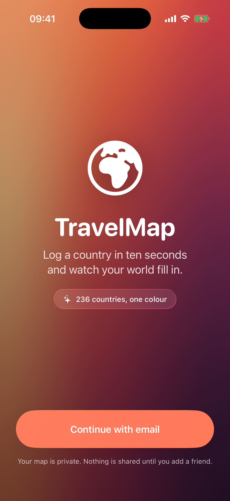
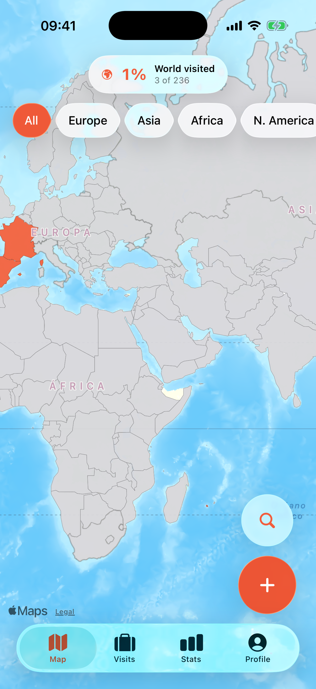
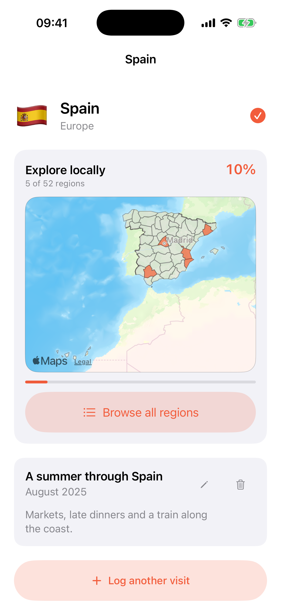
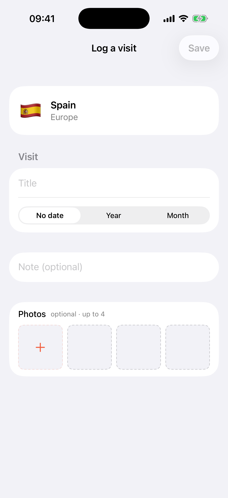
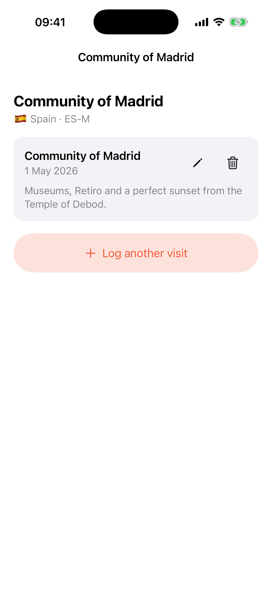
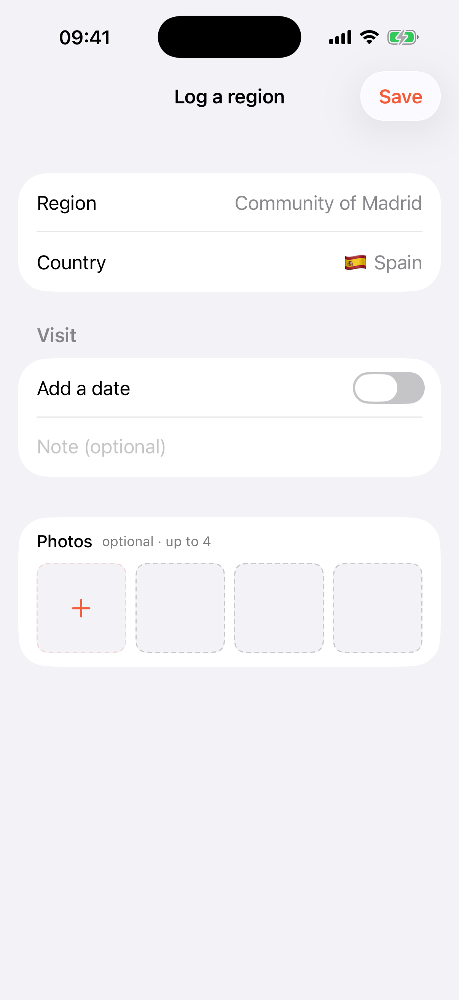
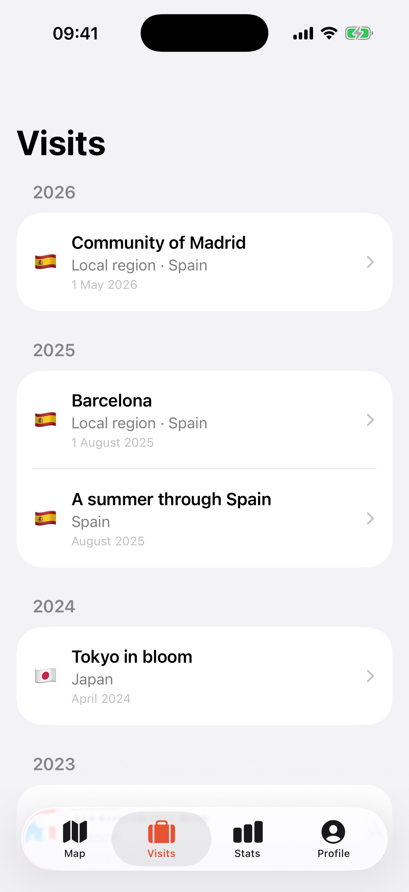
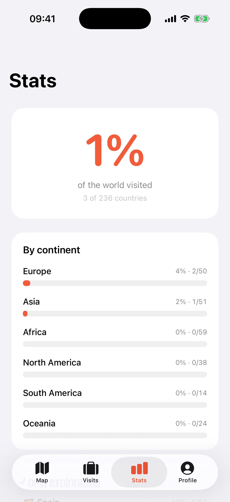
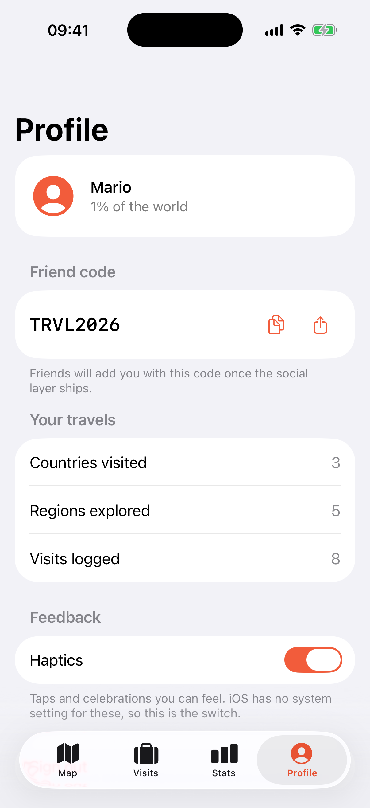

# TravelMap

Log the countries and local regions you've been to and watch your world fill in with colour.

An iOS app built around one idea: logging a place should take under ten seconds and never
be more than two taps away. The map is the hero — save a visit and the country fills in
straight away, with the percentage badge ticking up behind the sheet.

**iOS 26+ · SwiftUI · Liquid Glass · MapKit · Supabase**

## What it does

- **World map** — 236 countries as MapKit overlays, visited ones filled with the accent
  colour, everything else neutral gray. It opens framed on the countries you've logged.
- **Continent filter** — chips fly the camera and re-scope the live percentage
- **Log a visit** — add a title, year or month/year, note and up to four photos
- **Explore locally** — open a country to colour its provinces, states or other bundled
  first-level regions; 4,477 subdivisions are available offline
- **Regional visits** — tap a subdivision, attach a date, note and up to four photos, and
  see country-level regional progress once you begin
- **Visit timeline** — browse trips by when they happened and edit their details or photos
- **Home and lock screen widget** — your map, at a glance, in six sizes, scoped to the
  world or to one continent
- **Celebrations** — confetti and a haptic sized to what happened, from the first country
  to the continent you just finished
- **Stats** — how much of the world you've seen, broken down by continent
- **Sign in with Apple**, or email and password

Countries and borders come from [Natural Earth](https://www.naturalearthdata.com), bundled
and pre-simplified so the map is instant and works offline.

## Screens

<table>
  <tr>
    <td align="center"><br><sub>Introduction</sub></td>
    <td align="center"><br><sub>World map</sub></td>
    <td align="center"><br><sub>Local regions</sub></td>
  </tr>
  <tr>
    <td align="center"><br><sub>Log a country</sub></td>
    <td align="center"><br><sub>Region detail</sub></td>
    <td align="center"><br><sub>Log a region</sub></td>
  </tr>
  <tr>
    <td align="center"><br><sub>Visit timeline</sub></td>
    <td align="center"><br><sub>Stats</sub></td>
    <td align="center"><br><sub>Profile &amp; settings</sub></td>
  </tr>
</table>

## Getting started

1. Create a [Supabase](https://supabase.com) project and run
   [`supabase/schema.sql`](supabase/schema.sql) in its SQL editor.
2. Copy the credentials template and fill in your project URL and **publishable** key:
   ```bash
   cp Config.xcconfig.example Config.xcconfig
   ```
3. Open `TravelMap.xcodeproj` and run. Requires Xcode 26+.

Launching without step 2 is safe — the app detects the placeholder values and shows a
setup screen instead of failing at the first network call.

Sign in with Apple additionally needs an Apple Developer team and Supabase's Apple
provider enabled; email and password work without either.

## Running it on your iPhone

Four settings, all together at the top of [`project.yml`](project.yml):

```yaml
DEVELOPMENT_TEAM: MA7W7A6S66                     # your ten-character Team ID
SUPPORTS_SIGN_IN_WITH_APPLE: NO                  # YES needs a paid membership
APP_BUNDLE_ID: com.mariolandaburu.travelmap      # must be globally unique
APP_GROUP_ID: group.com.mariolandaburu.travelmap # how the app feeds the widget
```

Change them, run `xcodegen generate`, open the project, pick your phone and press Run.
Everything else derives from those four — the widget and test bundles, both entitlements
files, and the two values the app reads back at runtime.

**A free Apple ID runs almost all of it.** Map, photos, stats, celebrations, haptics,
email sign-in, and the widget with real data all work on a personal team; only **Sign in
with Apple** needs a paid [Apple Developer Program](https://developer.apple.com/programs/)
membership, and builds expire after seven days. The repository is set up that way already
— to turn Apple sign-in back on, flip `SUPPORTS_SIGN_IN_WITH_APPLE` to `YES` and restore
the commented-out `applesignin` entitlement next to it.

On the phone itself: enable **Developer Mode** (Settings ▸ Privacy & Security), and after
the first install trust yourself under Settings ▸ General ▸ VPN & Device Management.

The full version — the tested capability table and the command-line install path — is in
[AGENTS.md §11](AGENTS.md#11-running-on-a-device).

## Status

V2 is complete: countries, 4,477 local regions, photos, a combined visit timeline,
country and regional stats, widgets, and celebrations. The social layer remains planned
for V3.

**Full technical documentation — architecture, every file, known constraints and the
roadmap — lives in [AGENTS.md](AGENTS.md).**

## Licence

Not yet licensed. Natural Earth data is public domain.
